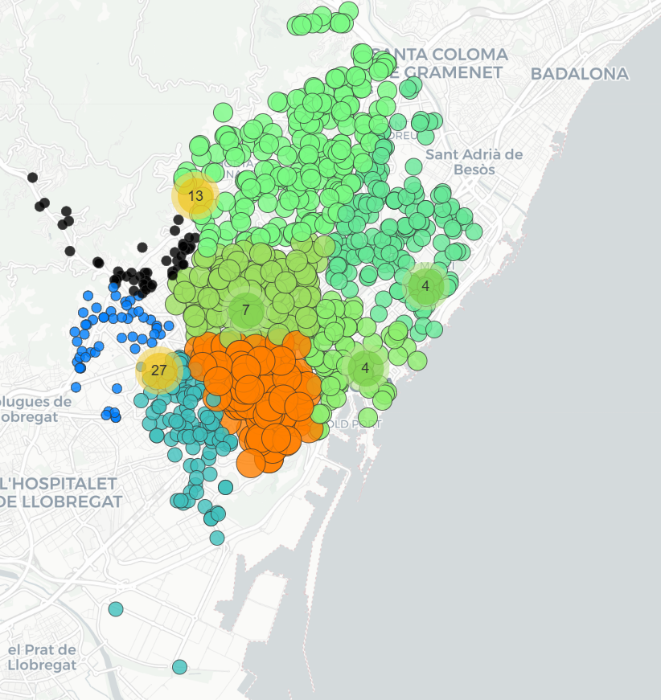
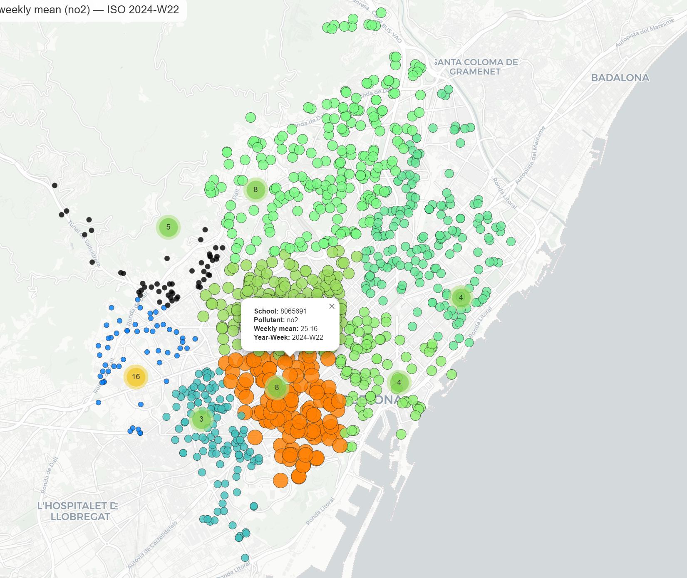
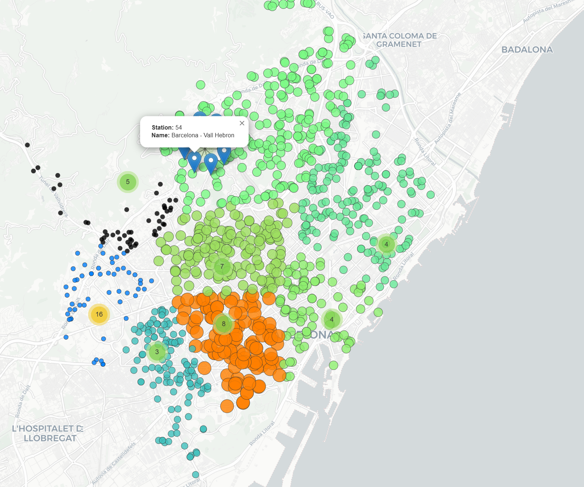
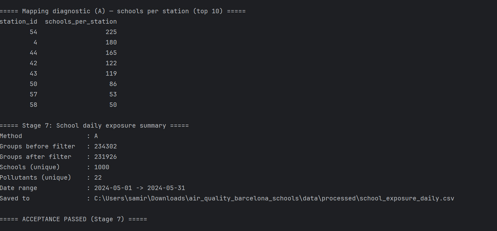

# Barcelona Schools Air Quality Pipeline

This project builds a reproducible ETL pipeline to clean, process, and map air quality exposure of schools in Barcelona.  
All scripts are written in Python and orchestrated as step-by-step stages.

---

## Project Structure

```
project_root/
  data/
    raw/                # original CSVs (stations, readings, schools)
    processed/          # cleaned & transformed outputs
  maps/                 # Folium maps + screenshots
  src/                  # pipeline scripts (stage1 .. stage9)
  README.md
  requirements.txt
```

---

## Quickstart (Windows, PowerShell)

```powershell
python -m venv .venv
.venv\Scripts\activate

pip install -r requirements.txt

# run stages sequentially
python src\stage0_check.py
python src\stage1_stations.py
python src\stage2_schools.py
python src\stage3_readings_long.py
python src\stage4_pollutant_map.py
python src\stage4b_filter_and_verify.py
python src\stage5_spatial_join.py
python src\stage6_exposure_logic.py
python src\stage7_daily_agg.py
python src\stage8_qc.py
python src\stage9_map.py
python src\stage_check_postfilter.py
```

Note: if `pyogrio` installation fails on Windows, install GDAL first or use `fiona` as a fallback.

---

## Key Outputs

- `data/processed/air_readings_long.csv` — hourly readings (long format).  
- `data/processed/stations_clean.geoparquet` — stations GeoDataFrame (EPSG:4326).  
- `data/processed/schools_bcn.geoparquet` — Barcelona schools GeoDataFrame (EPSG:4326).  
- `data/processed/station_daily.parquet` — daily means per station × pollutant.  
- `data/processed/schools_station_map.parquet` — school → nearest station mapping.  
- `data/processed/school_exposure_daily.csv` — daily school × pollutant exposure, coverage ≥75%.  
- `maps/school_exposure_map.html` — interactive Folium map (weekly NO₂ by default).  
- Reports:  
  - `data/processed/school_exposure_daily_qc_report.txt` — Stage 8 QC report.  
  - `data/processed/postfilter_checks_report.txt` — post-filter validation.

---

## Screenshots

Placed in `maps/`:

  
*Weekly school × pollutant exposure.*

  
*Popup example for a school.*

  
*Popup example for a station.*

  
*Console output showing all acceptance checks passed.*

---

## Pollutant Mapping and Filtering

- Whitelisted pollutants: `pm10, pm25, pm1, no, no2, o3, so2, co, benzene, toluene, xylene`.  
- Ozone (`o3`) comes strictly from code `9`.  
- Unknown codes (22, 901, 996–999) removed to avoid bias.

---

## Validation Summary (real run)

- Weeks present: ISO 2024-W18 .. W22 (May 2024).  
- Schools mapped: 1000; stations: 8.  
- School → nearest station distance: median ≈ 1.3 km, p95 ≈ 3.5 km, max ≈ 6.25 km.  
- Post-filter report: **PASS**.

---

## Limitations and Next Steps

- Nearest-station approach is coarse; buffer-based mapping could be added for robustness.  
- Units for some pollutants (CO, benzene, toluene) should be verified with the network codebook.  
- Always use metric CRS (**EPSG:25831**) for distance/buffer operations, then convert back to EPSG:4326.

---

## Requirements

Dependencies are pinned in `requirements.txt` for reproducibility (GeoPandas, PyArrow, Folium, etc.).
